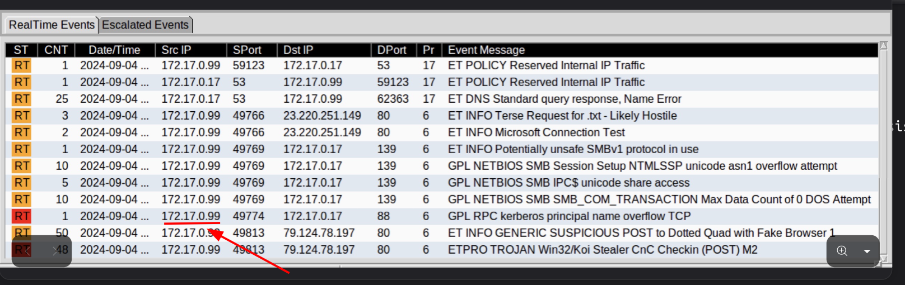
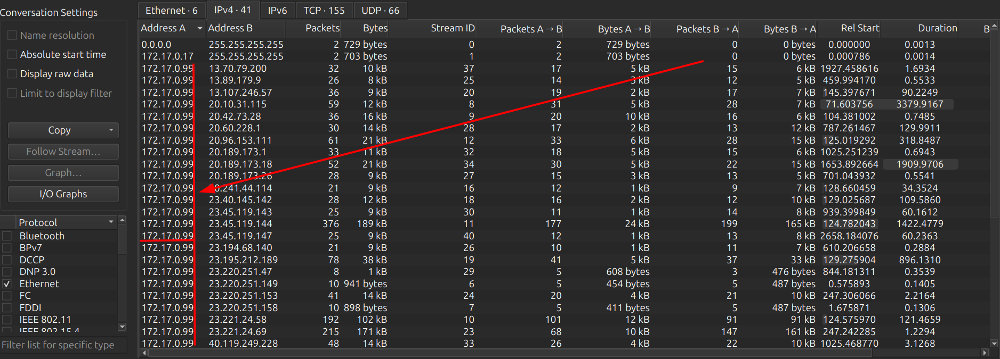
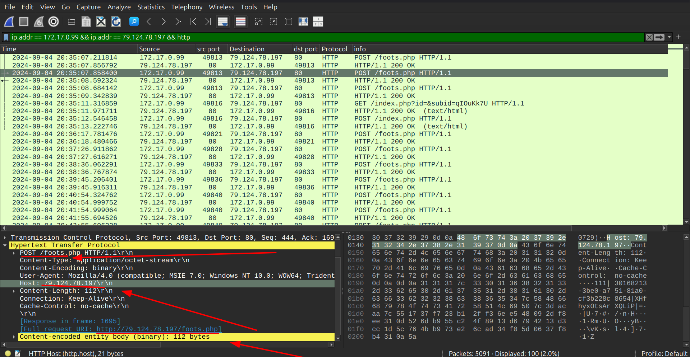
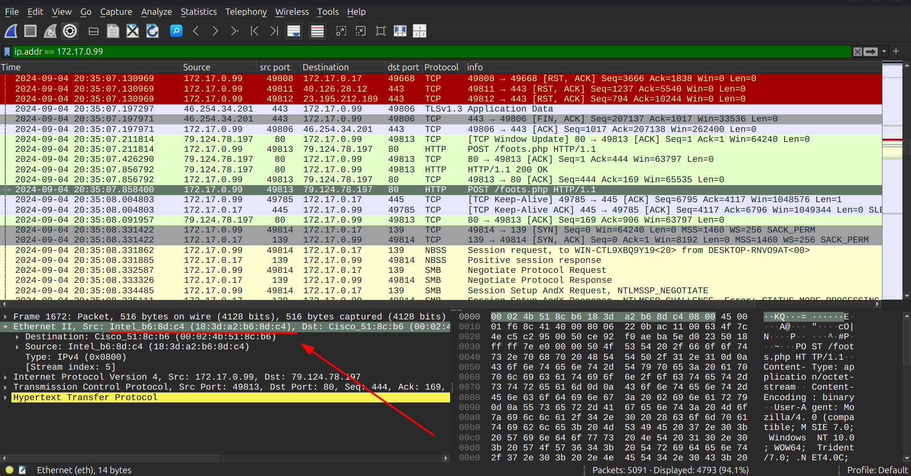
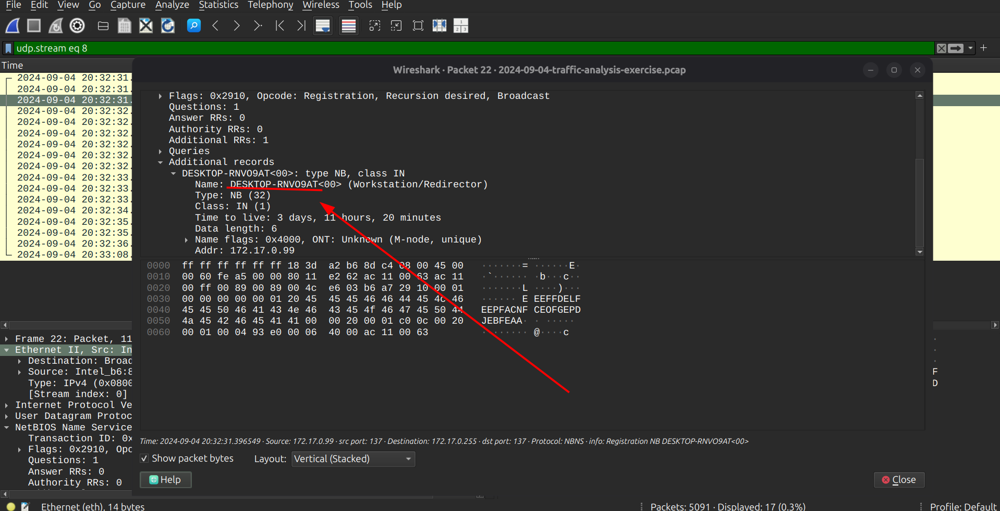
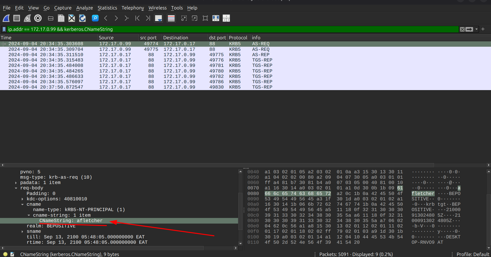
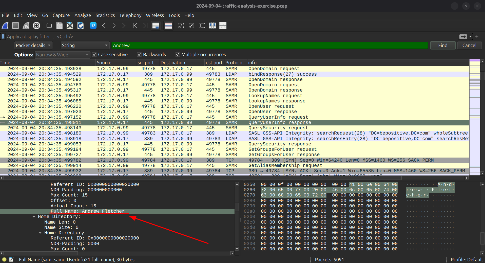

# MALWARE TRAFFIC ANALYSIS

Analysis date: 9-08-2026

### Source of PCAP:

Malware-Traffic-Analysis.net

### File Name:

2024-09-04-traffic-analysis-exercise.pcap

### Zip file password:

infected_20240904

### SCENARIO

Reviewing the alerts in your network environment, you find indicators that a host within your environment has been infected with malware..

- LAN Segment range: 172.17.0.0/24
  (172.17.0.0 - 172.17.0.255)

- Domain:
  bepositive.com

- Domain Controller:
  172.17.0.17 - WIN-CTL9XBQ9Y19

- AD Environment Name:
  BEPOSITIVE

- LAN Segment gateway:
  172.17.0.1

- LAN segment broadcast address:
  172.17.0.255

- Malware Source ip : 79.124.78.197

- TCP port: dst port 49813

- Infection Time:

### OBJECTIVES

1. Malware Name: Win32/Koi stealer

2. What is the IP of the infected Windows client?
   172.17.0.99

3. What is the Hostname of the infected windows client?
   DESKTOP-RNVO9AT

4. What is the MAC address of the infected windows client?
   18:3d:a2:b6:8d:c4

5. What is the user account name of the infected windows client?
   afletcher

6. What is the full name of the user from the infected windows user account?
   Andrew Fletcher

- Indicators Of Compromise

7. Data exfil ip : 79.124.78.197

8. Malicious URL : http[:]//79[.]124[.]78[.]197/foots.php

### ANALYSIS

- Infected windows client

To identify the IP of the infected windows client we obtain it from the alerts and filtering from network analysis in coversations which host is making the most conversations:

From the conversations we see that "172.17.0.99" is making alot of conversations with external ips:

Here we can see that some "POST" request traffic being done to the same malicious ip & url:

IP: _172.17.0.99_

- MAC Address of the infected windows host

Now that we have the IP of the Infected Windows Host,we need to identify its Mac address which we do so by filtering with its ip address "ip.addr == 172.17.0.99 " and find it in the Ethernet II, under src mac address.

Mac addr: _18:3d:a2:b6:8d:c4_

- Hostname of the infected windows client

To identify the hostname of the infected windows client we use the filter "nbns && ip.addr == 172.17.0.99"

Hostname: _DESKTOP-RNVO9AT_

- User Account Name

To identify the user account name we need to analyze Kerberos traffic to identify any username used for ticket granting,we use the filter

filter: "ip.addr == 172.17.0.99 && kerberos.CNameString"

We identify the user account to be:

The user account: _afletcher_

- Full Username of the user

To identify the full name of the the user of the compromised host we need to use the find option. "Ctrl + F" the filter for "packet details" + [String + case sensitive + multiple occurrences + backwards] and by trancating the user account name to "letch"

Full Username: _Andrew Fletcher_

