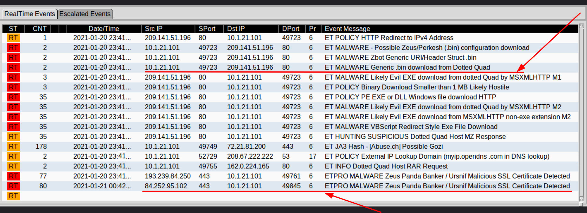
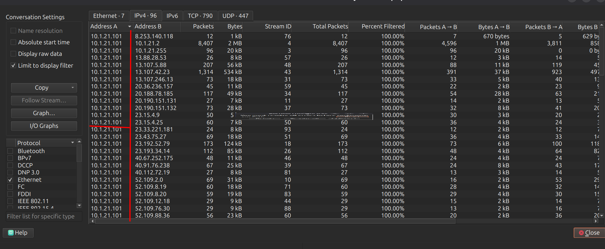
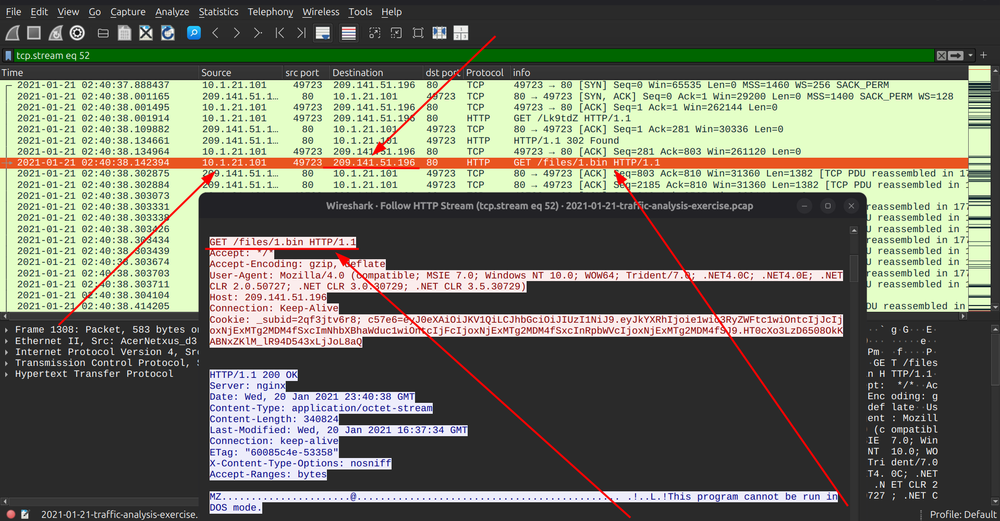
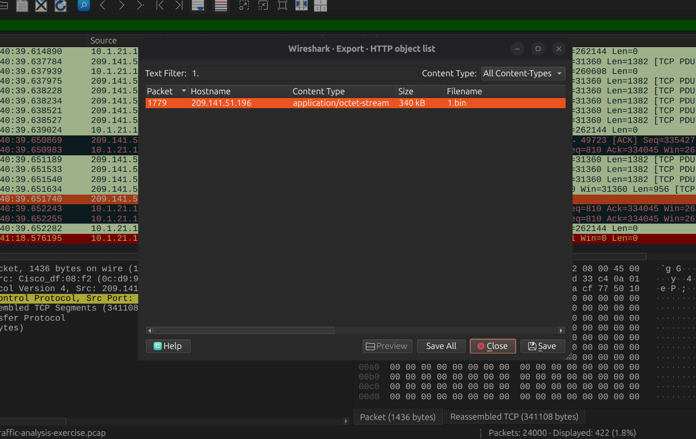
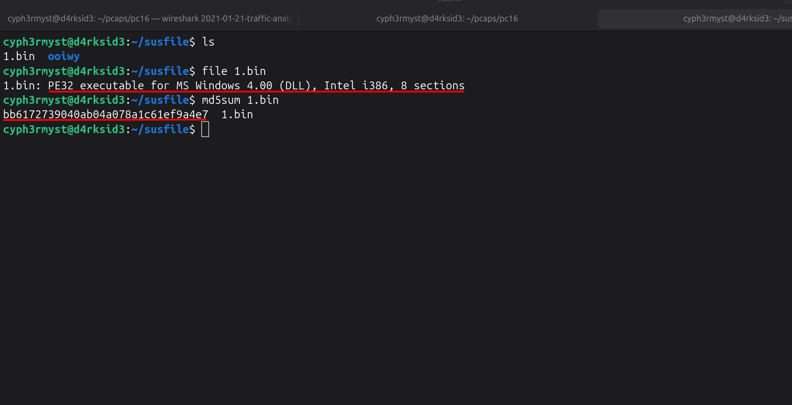
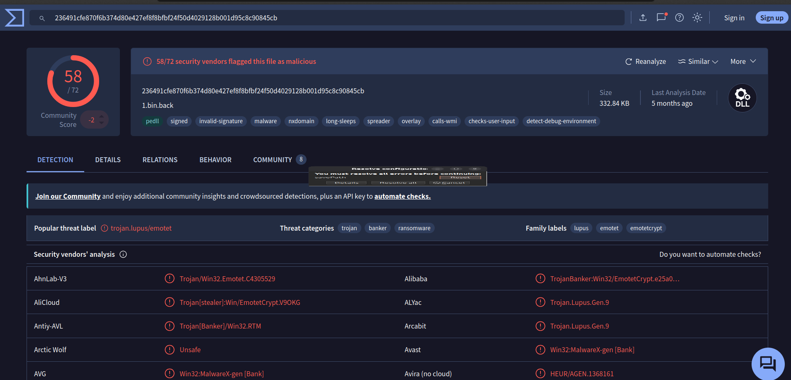
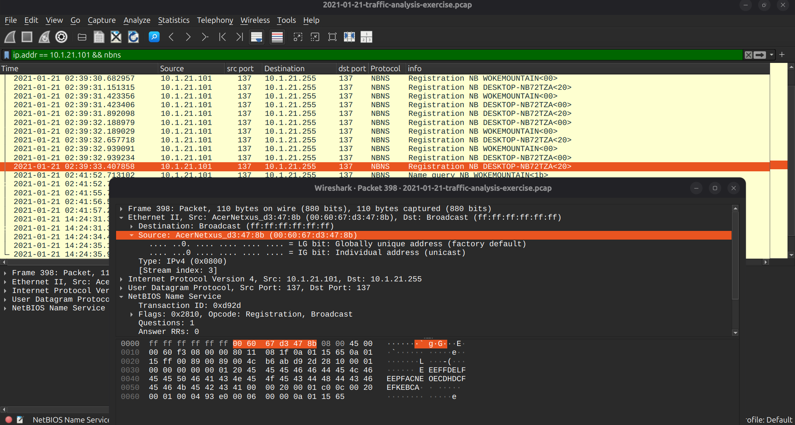
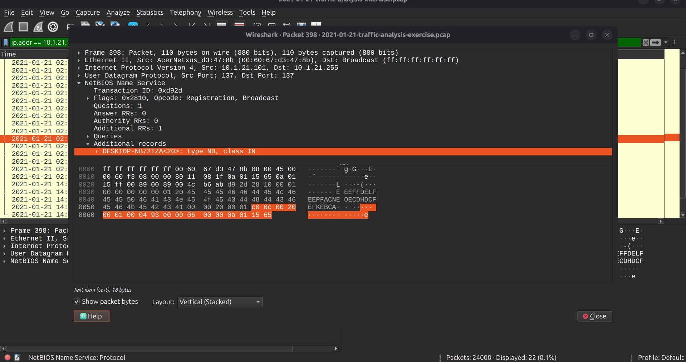

# MALWARE TRAFFIC ANALYSIS

Analysis date: 24-08-2026

### Source of PCAP:

Malware-Traffic-Analysis.net

### File Name:

2021-01-21-traffic-analysis-exercise.pcap

### Zip file password:

infected_20210121

### SCENARIO

- LAN Segment range: 10.1.21.0/24 (10.1.21.0 through 10.1.21.255)

- Domain: wokemountain.com

- Domain Controller: 10.1.21.2 - WokeMountain-DC

- LAN Segment gateway: 10.1.21.1

- LAN segment broadcast address: 10.1.21.255

### OBJECTIVES

1. Malware Name:
   trojan.lupus/emotet

2. What is the IP of the infected Windows client?
   10.1.21.101

3. What is the Hostname of the infected windows client?
   DESKTOP-NB72TZA

4. What is the MAC address of the infected windows client?
   00:60:67:d3:47:8b

5. What is the user account name of the infected windows client?

6. What is the full name of the user from the infected windows user account? <>

- Indicators Of Compromise

7. Data exfil ip :
   52.109.2.0

8. Malicious URL :
   http[:]//209[.]141[.]51[.]196/files/1.bin

9. Malware Source: ip :
   209.141.51.196

10. TCP port: src port 49723

11. Infection Time:
    2021-01-21 @ 2:40:38

### ANALYSIS

- Infected windows client

From the alerts we can identify the host with ip "10.1.21.101" downloaded a .bin file from "209.141.51.196"/

From "conversations" we can still see that the ip is making alot of traffic with external ips:

From the http traffic we can now identify the host host made a "GET" request to "209.141.51.196" and downloaded a binary file named "1.bin"

Export the file for further analysis:

Identify the file type and its md5 hash:

The suspicious binary file hash is:
_bb6172739040ab04a078a1c61ef9a4e7_

A look up to virustotal identifies the file as:

\*\* confirming the host is infected.

IP: _10.1.21.101_

- MAC Address of the infected windows host

Now that we have the IP of the Infected Windows Host,we need to identify its Mac address which we do so by filtering with its ip address "ip.addr == 10.1.21.101 " and find it in the Ethernet II, under src mac address.

Mac addr:_00:60:67:d3:47:8b_

- Hostname of the infected windows client

To identify the hostname of the infected windows client we use the filter "nbns && ip.addr == 10.1.21.101"

Hostname: _DESKTOP-NB72TZA_

#### // ATTEMPTS TO IDENTIFY THE ACCOUNT AND USERNAME FAILED !

- User Account Name

- Full Username of the user
