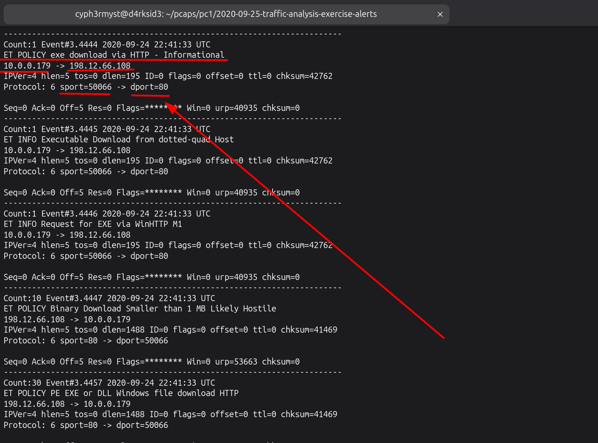
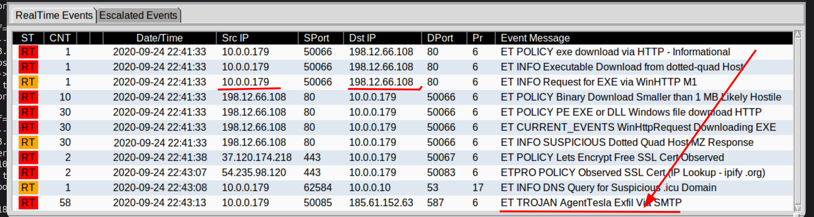
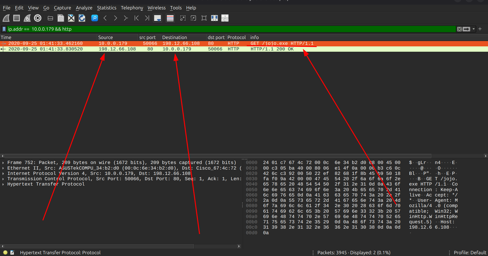
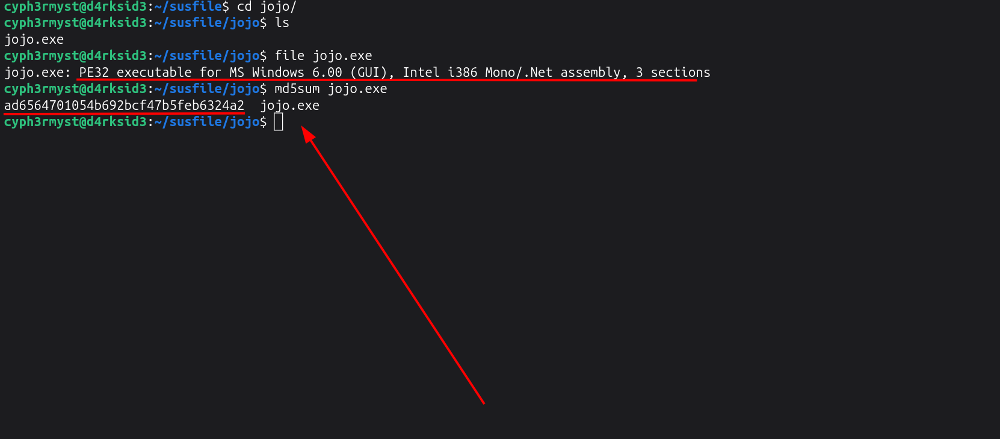
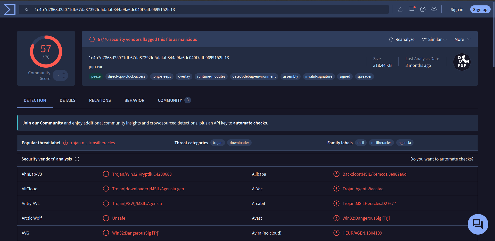
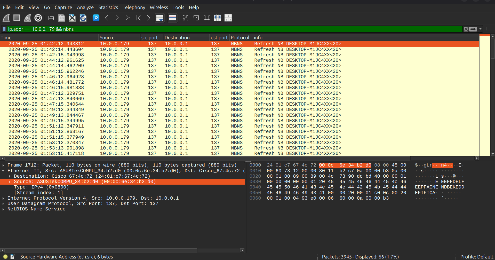
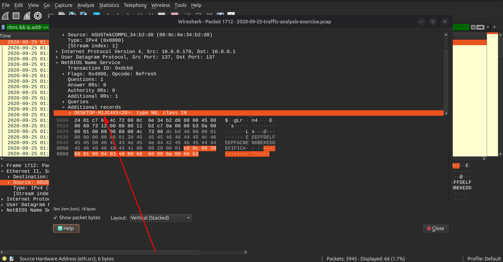
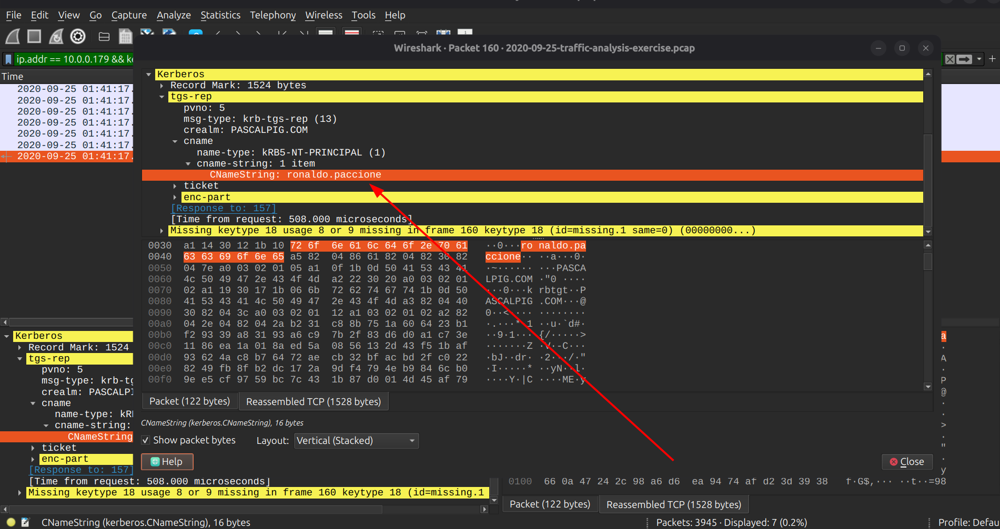
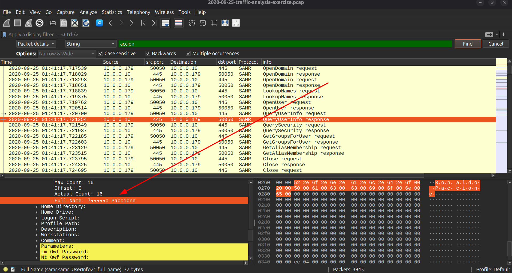
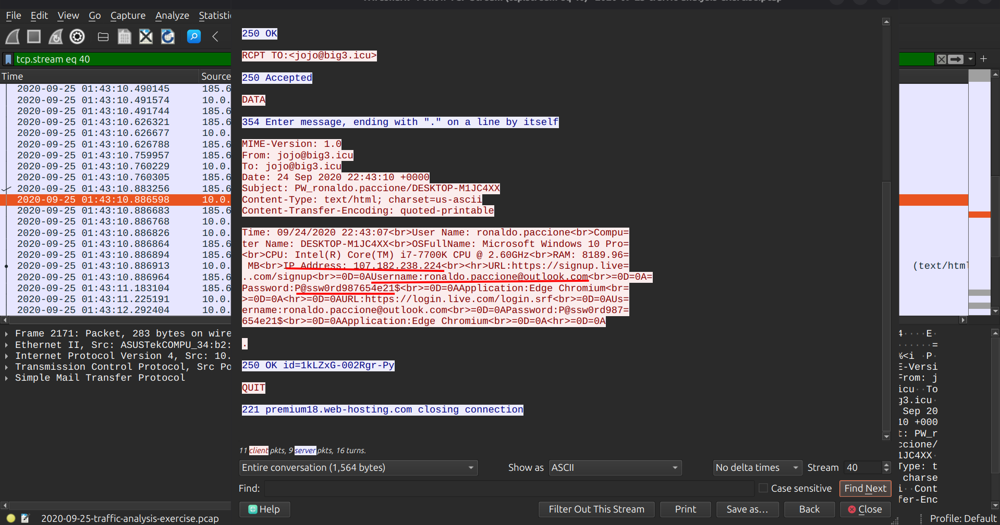

# MALWARE TRAFFIC ANALYSIS

Analysis date:

### Source of PCAP:

Malware-Traffic-Analysis.net

### File Name:

2020-09-25-traffic-analysis-exercise.pcap

### Zip file password:

infected_20200925

### SCENARIO

- LAN Segment range:
  10.0.0.0/24 (10.0.0.0 through 10.0.0.255)

- Domain:
  pascalpig.com

- Domain Controller:
  10.0.0[.]10 - Pascalpig-DC

- LAN Segment gateway:
  10.0.0.1

- LAN segment broadcast address:
  10.9.25.255

### OBJECTIVES

1. Malware Name: AgentTesla

2. What is the IP of the infected Windows client? <>

3. What is the Hostname of the infected windows client? <>

4. What is the MAC address of the infected windows client? <>

5. What is the user account name of the infected windows client? <>

6. What is the full name of the user from the infected windows user account? <>

- Indicators Of Compromise

7. Data exfil ip :
   185.61.152.63

8. Malicious URL : http[:]//198[.]12[.]66[.]108/

9. Malware Source: ip :  
   198.12.66.108

10. TCP port: src port: 50066

11. Infection Time:

    2020-09-25 @ 1:41:33

12. Suspicious domain: jojo@big3.icu

### ANALYSIS

- Infected windows client
  From the alerts we now have two ips to monitor their traffic which seems suspicious "10.0.0.179" which is an internal host and "185.61.152.63" which is an outsider ip.

Now analyzing the traffic made by the two ips we can identify in http traffic that "10.0.0.179" made a http GET request for an excutable to "185.61.152.63" named "jojo.exe"

Analyzing the file abit we find out its indeed a windows executable with md5 hash of _ad6564701054b692bcf47b5feb6324a2_ :

A virus total look up for the hash confirms that indeed the host is infected with " trojan.msil/msilheracles " :

IP: _10.0.0.179_

- MAC Address of the infected windows host

Now that we have the IP of the Infected Windows Host,we need to identify its Mac address which we do so by filtering with its ip address "ip.addr == 10.0.0.179 " and find it in the Ethernet II, under src mac address.

Mac addr: _00:0c:6e:34:b2:d0_

- Hostname of the infected windows client

To identify the hostname of the infected windows client we use the filter "nbns && ip.addr == 10.0.0.179"

Hostname: _DESKTOP-M1JC4XX_

- User Account Name

To identify the user account name we need to analyze Kerberos traffic to identify any username used for ticket granting,we use the filter

filter: "ip.addr == 10.0.0.179 && kerberos.CNameString"

We identify the user account to be:

The user account: ronaldo.paccione

- Full Username of the user

To identify the full name of the the user of the compromised host we need to use the find option. "Ctrl + F" the filter for "packet details" + [String + case sensitive + multiple occurrences + backwards] and by trancating the user account name to "accion"

Now the full name we got i likely gibbberish "⹒⹯⹮⹡⹬⹤o Paccione" but we assume the full name is: _"Ronaldo Paccione"_

Full Username: _Ronaldo Paccione_

- Data Exfiltration

Analyzing if there was data exfiltrated filter "smtp" we findout that internal data was being exfiltrated to "185.61.152.63":

