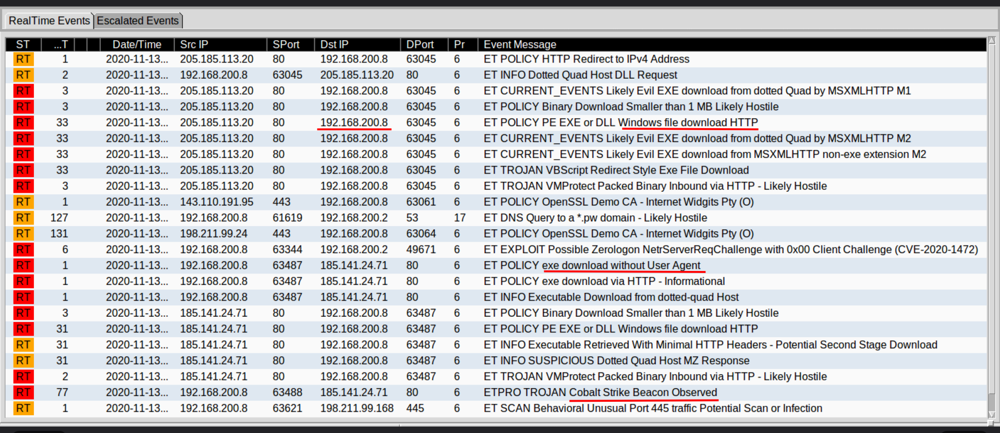
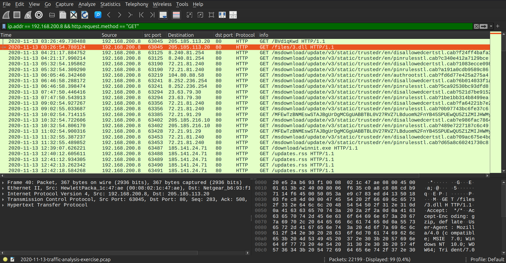
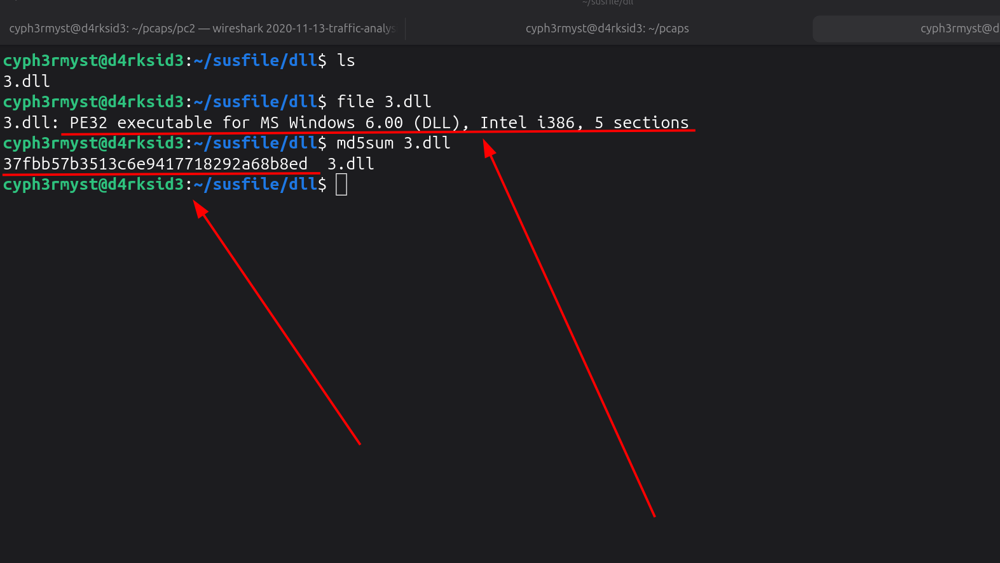
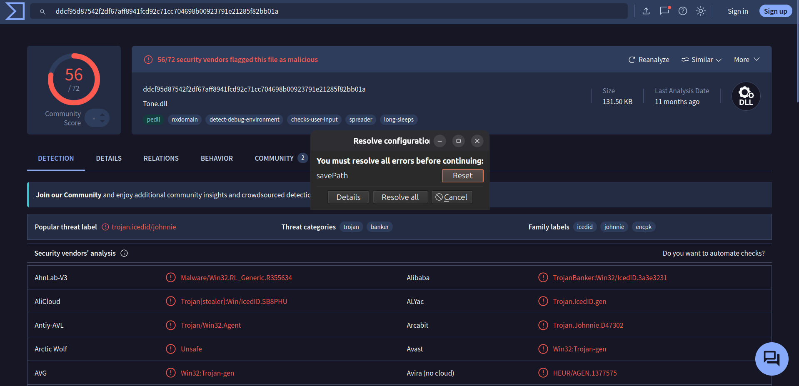
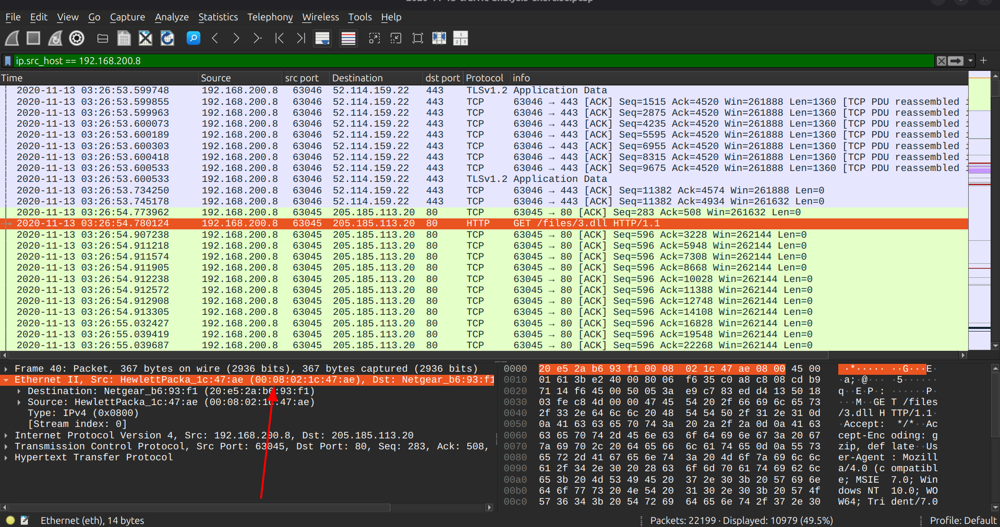
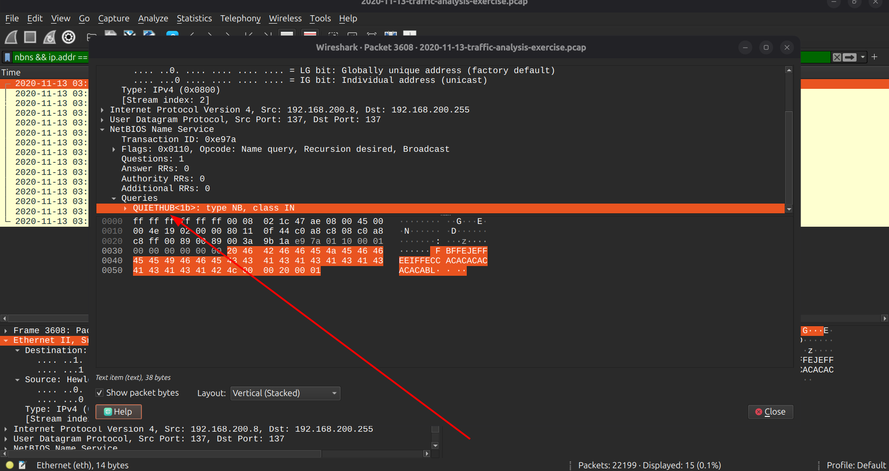
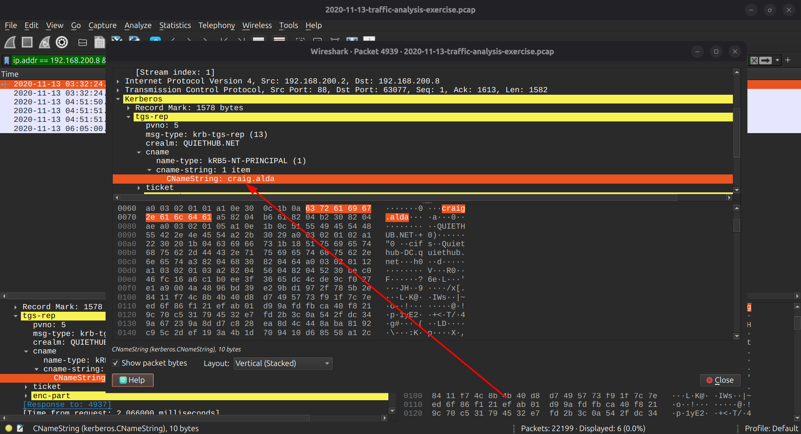

# MALWARE TRAFFIC ANALYSIS

Analysis date:

### Source of PCAP:

Malware-Traffic-Analysis.net

### File Name:

2020-11-13-traffic-analysis-exercise.pcap.zip

### Zip file password:

infected_20201113

### SCENARIO

- LAN Segment range: 192.168.200.0/24 (192.168.200.0 through 192.168.200.255)

- Domain:
  quiethub.net

- Domain Controller:
  192.168.200[.]10 - Quiethub-DC

- LAN Segment gateway:
  192.168.200.1

- LAN segment broadcast address:
  192.168.200.255

### OBJECTIVES

1. Malware Name:

2. What is the IP of the infected Windows client?  
   192.168.200.8

3. What is the Hostname of the infected windows client?
   QUIETHUB

4. What is the MAC address of the infected windows client?
   00:08:02:1c:47:ae

5. What is the user account name of the infected windows client?
   craig.alda

6. What is the full name of the user from the infected windows user account?
   Craig Alda

- Indicators Of Compromise

7. Data exfil ip : ?

8. Malicious URL : http[:]//205[.]185[.]113[.]20/BVd1qKwd

9. Malware Source: ip : 205.185.113.20

10. TCP port: src port 63045

11. Infection Time:
    2020-11-13 @ 3:26:54

### ANALYSIS

- Infected windows client

From the alerts we observer some unusual behaviour traffic happenning to "192.168.200.8":

From the http traffic we can see that the host "192.168.200.8" made a GET request for a file named "3.dll" filter: ip.addr == 192.168.200.8 && http.request.method == "GET":

Analyzing the file further we find out that its a windows executable file with md5 hash of _37fbb57b3513c6e9417718292a68b8ed_ identified as " trojan.icedid/johnnie":

Performing a virus total lookup for the file identified with the hash above we find out that its " ".

IP: _192.168.200.8_

- MAC Address of the infected windows host

Now that we have the IP of the Infected Windows Host,we need to identify its Mac address which we do so by filtering with its ip address "ip.src_host == 192.168.200.8 " and find it in the Ethernet II, under src mac address.

Mac addr: _00:08:02:1c:47:ae_

- Hostname of the infected windows client

To identify the hostname of the infected windows client we use the filter "nbns && ip.addr == 192.168.200.8 "

Hostname: _QUIETHUB_

- User Account Name

To identify the user account name we need to analyze Kerberos traffic to identify any username used for ticket granting,we use the filter

filter: "ip.addr == 192.168.200.8 && kerberos.CNameString"

We identify the user account to be:

The user account: _craig.alda_

- Full Username of the user

To identify the full name of the the user of the compromised host we need to use the find option. "Ctrl + F" the filter for "packet details" + [String + case sensitive + multiple occurrences + backwards] and by trancating the user account name to "lda"

Full Username: _Craig Alda_
