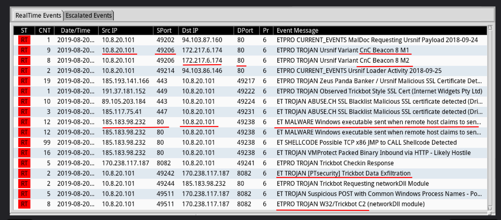
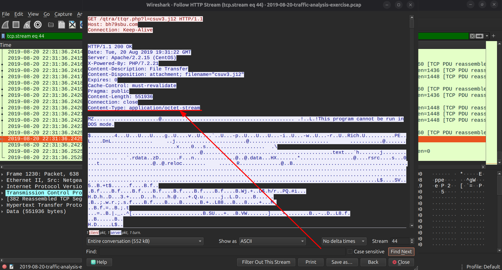
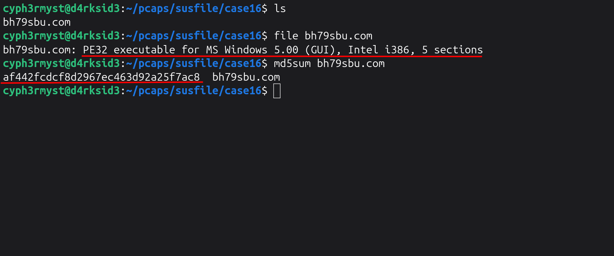
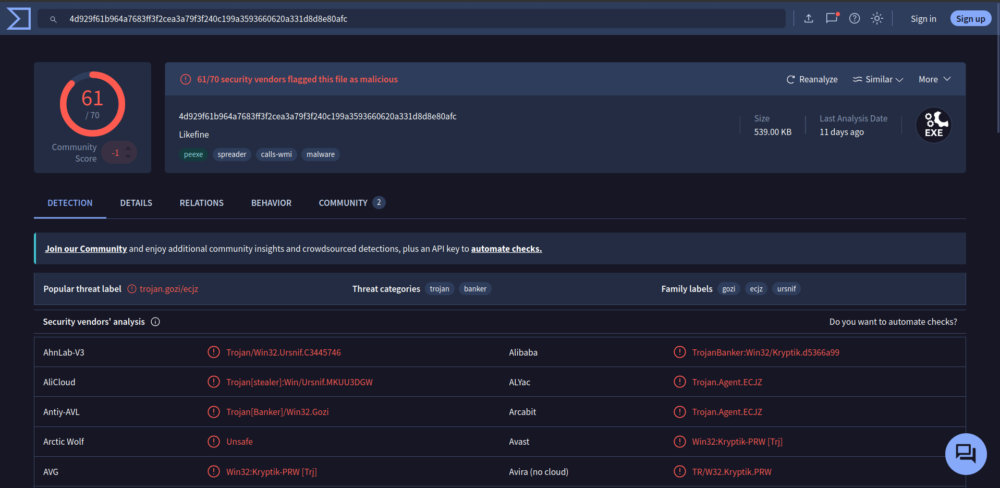
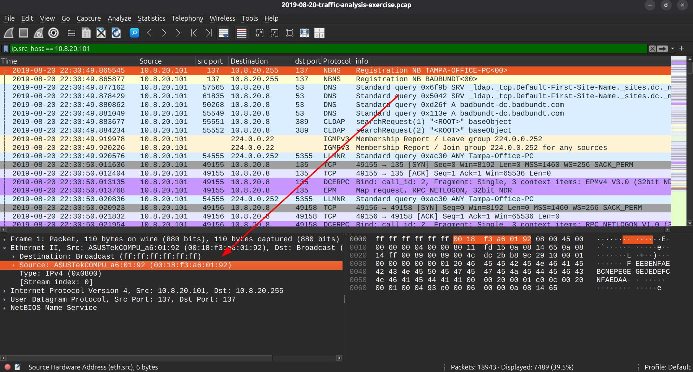
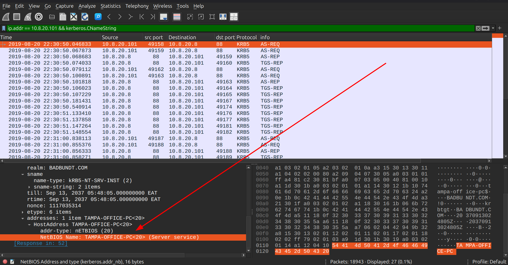
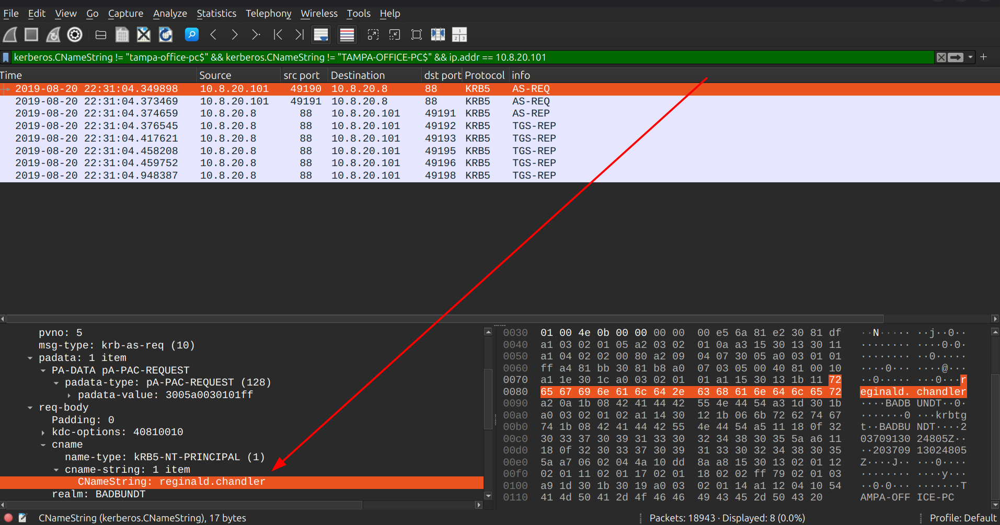

# MALWARE TRAFFIC ANALYSIS

Analysis date: 28-08-2026

### Source of PCAP:

Malware-Traffic-Analysis.net

### File Name:

2019-08-20-traffic-analysis-exercise.pcap

### Zip file password:

infected_20190820

### SCENARIO

- LAN Segment range: 10.8.20.0/24 (10.8.20.0 through 10.8.20.255)

- Domain: badbundt.com

- Domain Controller: 10.8.20.8 (BadBundt-DC)

- LAN Segment gateway: 10.8.20.1

- LAN segment broadcast address: 10.8.20.255

### OBJECTIVES

1. Malware Name: trojan.gozi/ecjz

2. What is the IP of the infected Windows client? 10.8.20.101

3. What is the Hostname of the infected windows client? TAMPA-OFFICE-PC

4. What is the MAC address of the infected windows client? 00:18:f3:a6:01:92

5. What is the user account name of the infected windows client? reginald.chandler

6. What is the full name of the user from the infected windows user account? Reginald chandler

- Indicators Of Compromise

7. Suspicious IPs : 94.103.87.100,172.217.6.174,185.183.98.232

8. Suspicious URL : http[:]//bh79sbu[.]com/qtra/ttqr.php?l=csuv3.j12

9. Malware Source: ip : 94.103.87.100

10. TCP port: src port 49202

11. Infection Time:? 2019-08-20 @ 22:31:33

### ANALYSIS

- Infected windows client

From the alerts some information stands out about the host "10.8.20.101" it seems to have CnC beacons which reflect know malware like Zeus Panda and TrickBot 2:

The same ip is found to be downloading a binary file from the domain **bh79sbu.com**:

Now exporting that object and performing some basic analysis on it we find out that it a windows excutable with file hash of _"af442fcdcf8d2967ec463d92a25f7ac8"_:

Now performing a lookup on virus total for that has we find out that its a ""

IP: _10.8.20.101_

- MAC Address of the infected windows host

Now that we have the IP of the Infected Windows Host,we need to identify its Mac address which we do so by filtering with its ip address "ip.addr == 10.8.20.101 " and find it in the Ethernet II, under src mac address.

Mac addr: _00:18:f3:a6:01:92_

- Hostname of the infected windows client

To identify the hostname of the infected windows client we use the filter "nbns && ip.addr == 10.8.20.101"

Hostname: _TAMPA-OFFICE-PC_

- User Account Name

To identify the user account name we need to analyze Kerberos traffic to identify any username used for ticket granting,we use the filter

filter: "kerberos.CNameString != "tampa-office-pc$" && kerberos.CNameString != "TAMPA-OFFICE-PC$" && ip.addr == 10.8.20.101"

We identify the user account to be:

The user account: _reginald.chandler_

- Full Username of the user

To identify the full name of the the user of the compromised host we need to use the find option. "Ctrl + F" the filter for "packet details" + [String + case sensitive + multiple occurrences + backwards] and by trancating the user account name to "<>"

Full Username: _Reginald chandler_
