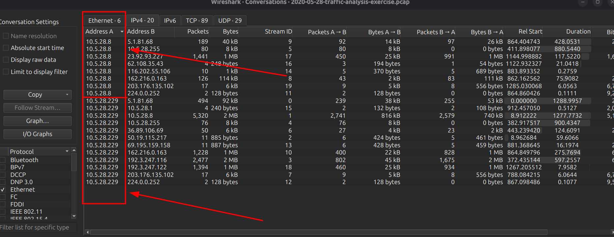
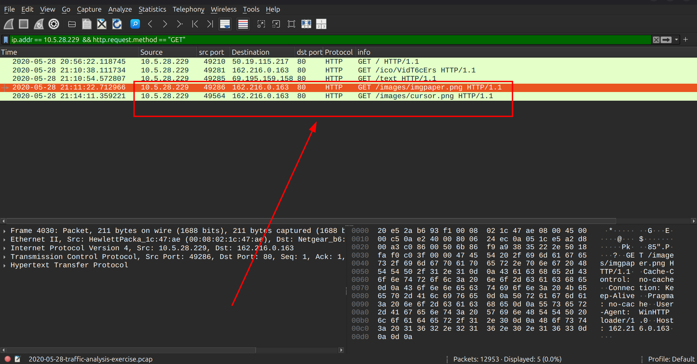
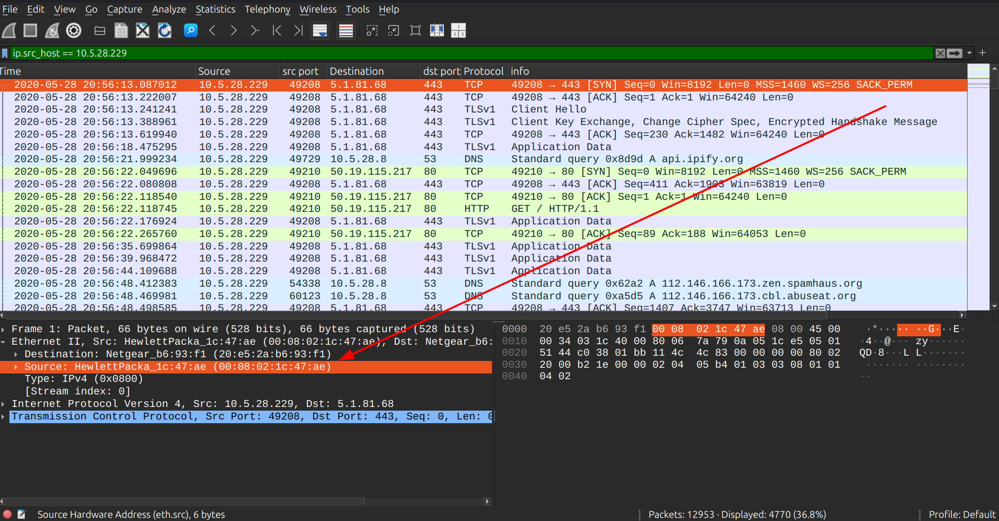
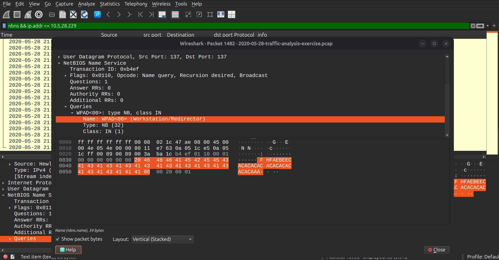
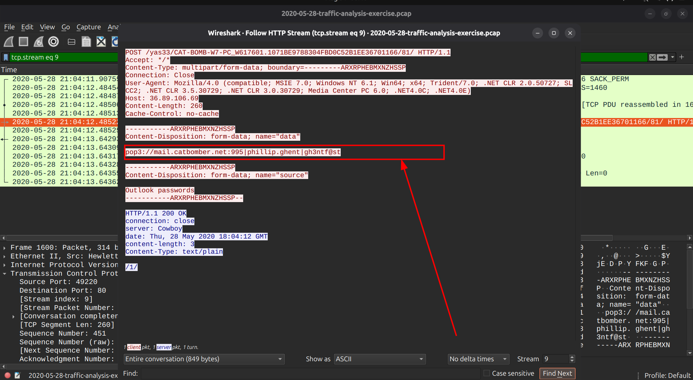
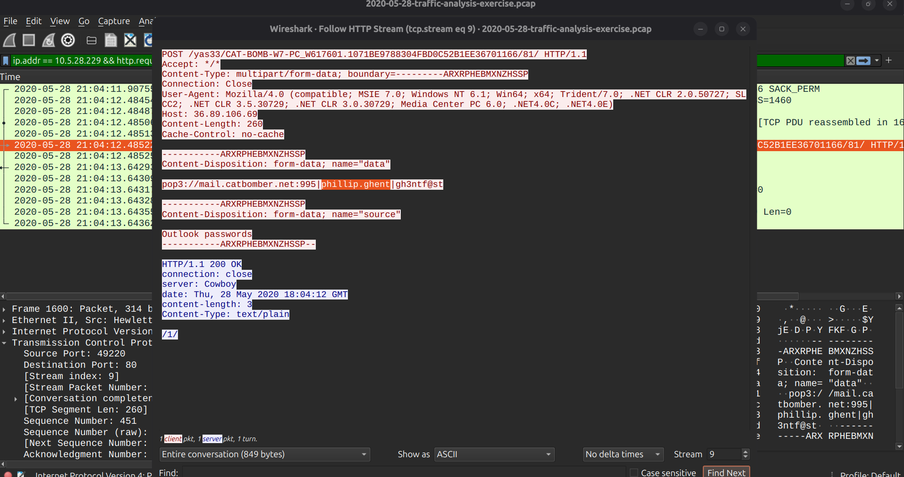

# MALWARE TRAFFIC ANALYSIS

Analysis date: 31-088-2026

### Source of PCAP:

Malware-Traffic-Analysis.net

### File Name:

2020-05-28-traffic-analysis-exercise.pcap

### Zip file password:

infected_20200528

### SCENARIO

- LAN Segment range: 10.5.28.0/24 (10.5.28.0 through 10.5.28.255)

- Domain: catbomber.net

- Domain Controller: 10.5.28.8 - Catbomber-DC

- LAN Segment gateway: 10.5.28.1

- LAN segment broadcast address: 10.5.28.255

### OBJECTIVES

1. Malware Name: <>

2. What is the IP of the infected Windows client? 10.5.28.229

3. What is the Hostname of the infected windows client? WPAD

4. What is the MAC address of the infected windows client? 00:08:02:1c:47:ae

5. What is the user account name of the infected windows client? phillip.ghent

6. What is the infected user's email password? gh3ntf@st

7. What is the other user account name and other Windows client host name found in the Trickbot HTTP POST traffic? CATBOMBER-DC

8. Two Windows executable files are sent in the network traffic. What are the SHA256 file hashes for these files?

- cursor.png: 4e76d73f3b303e481036ada80c2eeba8db2f306cbc9323748560843c80b2fed1

- imgpaper.png: 934c84524389ecfb3b1dfcb28f9697a2b52ea0ebcaa510469f0d2d9086bcc79a

9. What is the full name of the user from the infected windows user account? Phillip Ghent

- Indicators Of Compromise

7. Suspicious IPs : 162.216.0.163

8. Suspicious URL : http[:]//162.216.0.163/images/imgpaper[.]png

9. Malware Source: ip : 162.216.0.163

10. TCP port: src port : 49286

11. Infection Time:
    2020-05-28 @ 21:11:22

### ANALYSIS

- Infected windows client
  From convrsations we identify two ips making alot of traffic "10.5.28.8 and 10.5.28.229":

The traffic obtained from the http rquests shows that the host with ip "10.5.28.229 " made a GET request for two files disguised as .png files but are actually windows executables:

Th two files are identified with sha256 hash of:

1. cursor.png "_4e76d73f3b303e481036ada80c2eeba8db2f306cbc9323748560843c80b2fed1_"

2. imgpaper.png
   "_934c84524389ecfb3b1dfcb28f9697a2b52ea0ebcaa510469f0d2d9086bcc79a_"

Performing a file has lookup identifies the files to be:

IP: _10.5.28.229_

- MAC Address of the infected windows host

Now that we have the IP of the Infected Windows Host,we need to identify its Mac address which we do so by filtering with its ip address "ip.addr == 10.5.28.229" and find it in the Ethernet II, under src mac address.

Mac addr: _00:08:02:1c:47:ae_

- Hostname of the infected windows client

To identify the hostname of the infected windows client we use the filter "nbns && ip.addr == 10.5.28.229"

Hostname: _WPAD_

- User Account Name

To identify the user account name we need to analyze Kerberos traffic to identify any username used for ticket granting,we use the filter

filter: "ip.addr == 10.5.28.229 && http.request.method == "POST""

We identify the user account to be:

The user account: _phillip.ghent_

- Full Username of the user

We obtain the username from the popmail account leaked together with the password "_gh3ntf@st_"

Full Username: _Phillip Ghent_
