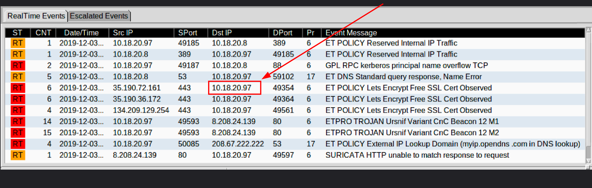
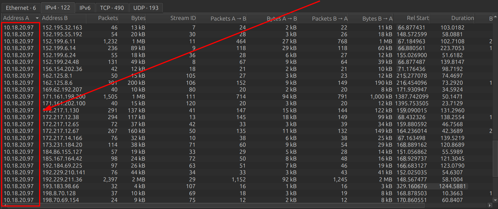
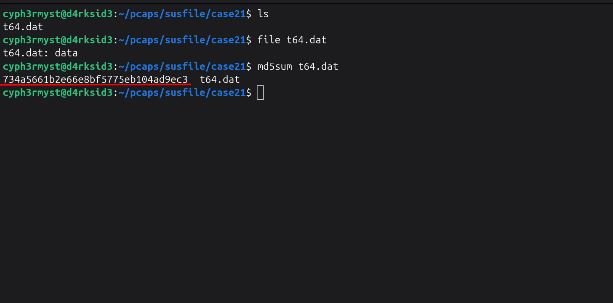
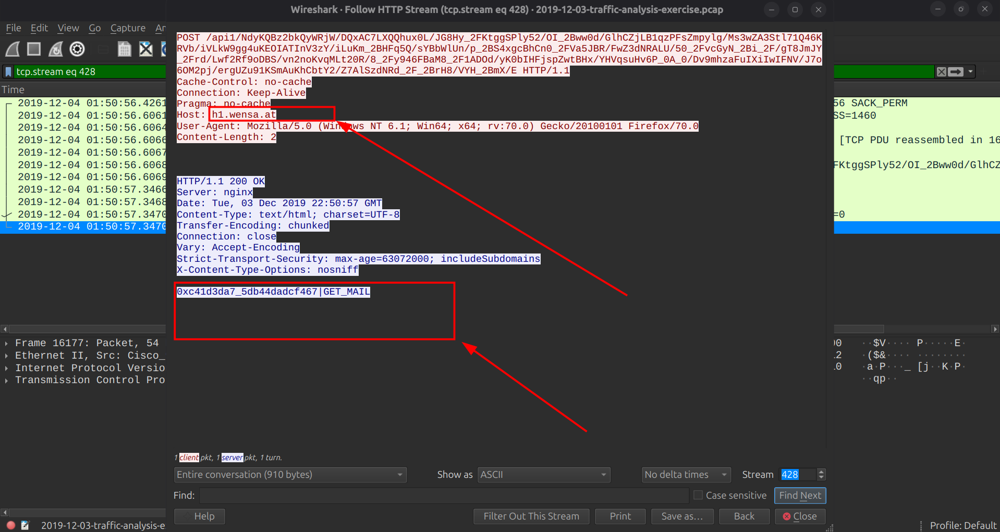
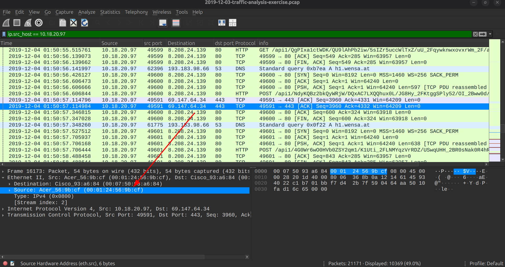
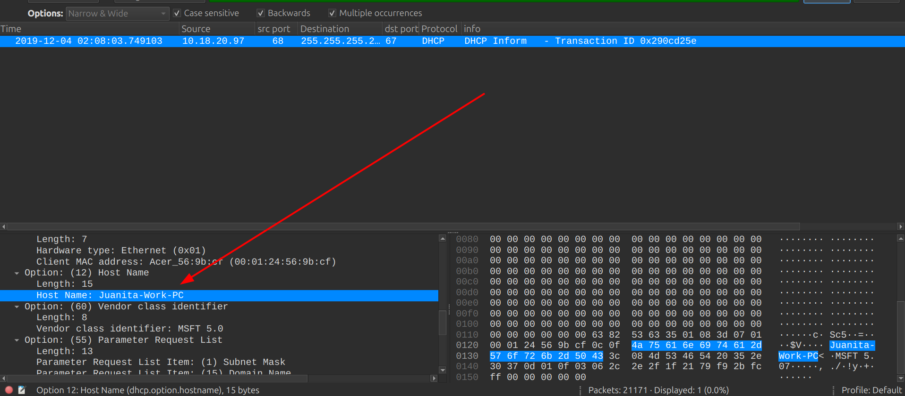
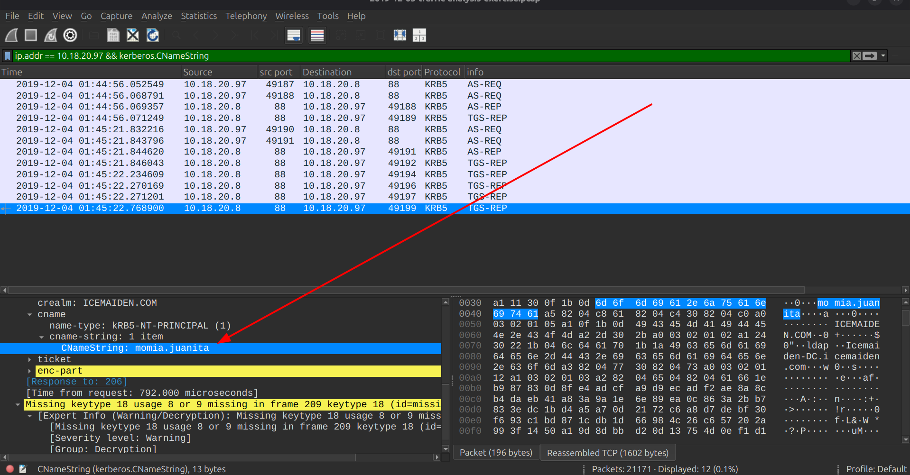

# MALWARE TRAFFIC ANALYSIS

Analysis date: 5 sep 2026

### Source of PCAP:

Malware-Traffic-Analysis.net

### File Name:

2019-12-03-traffic-analysis-exercise.pcap

### Zip file password:

infected_20191203

### SCENARIO

- LAN Segment range: 10.18.20.0/24 (10.18.20.0 through 10.18.20.255)

- Domain: icemaiden.com

- Domain Controller: 10.18.20.8 - Icemaiden-DC

- LAN Segment gateway: 10.18.20.1

- LAN segment broadcast address: 10.18.20.255

### OBJECTIVES

1. Malware Name: <>

2. What is the IP of the infected Windows client? 10.18.20.97

3. What is the Hostname of the infected windows client? Juanita-Work-PC

4. What is the MAC address of the infected windows client? 00:01:24:56:9b:cf

5. What is the user account name of the infected windows client? momia.juanita

6. What is the full name of the user from the infected windows user account? Momia Juanita

- Indicators Of Compromise

7. Suspicious IPs : 35.190.36.172

8. Suspicious URL : "http[:]//h1.wensa[.]'at/api1/NdyKQBz2bkQyWR"

9. Malware Source: ip : 8.208.24.139

10. TCP port: src port 49598

11. Infection Time:2019-12-04 @ 1:50:40

### ANALYSIS

- Infected windows client
  From the alerts,the host generating alerts and is amking contants with external ips is "10.18.20.97":

  

  In conversations,the same ip is seen to make alot of contacts with external ips:

  

  Inspecting HTTP objects we identify a ".dat" file which looks like an executable with md5sum of _"734a5661b2e66e8bf5775eb104ad9ec3"_

Performing futher analysis we idntify what could be some data leaks to "h1.wensa.at":

IP: _10.18.20.97_

- MAC Address of the infected windows host

Now that we have the IP of the Infected Windows Host,we need to identify its Mac address which we do so by filtering with its ip address "ip.srchost == 10.18.20.97 " and find it in the Ethernet II, under src mac address.

Mac addr: _00:01:24:56:9b:cf_

- Hostname of the infected windows client

To identify the hostname of the infected windows client we use the filter "nbns && ip.addr == 10.18.20.97"

Hostname: _Juanita-Work-PC_

- User Account Name

To identify the user account name we need to analyze Kerberos traffic to identify any username used for ticket granting,we use the filter

filter: "ip.addr == 10.18.20.97 && kerberos.CNameString"

We identify the user account to be:

The user account: _momia.juanita_

- Full Username of the user

To identify the full name of the the user of the compromised host we need to use the find option. "Ctrl + F" the filter for "packet details" + [String + case sensitive + multiple occurrences + backwards] and by trancating the user account name to "uanita"

Full Username: _Momia Juanita_
